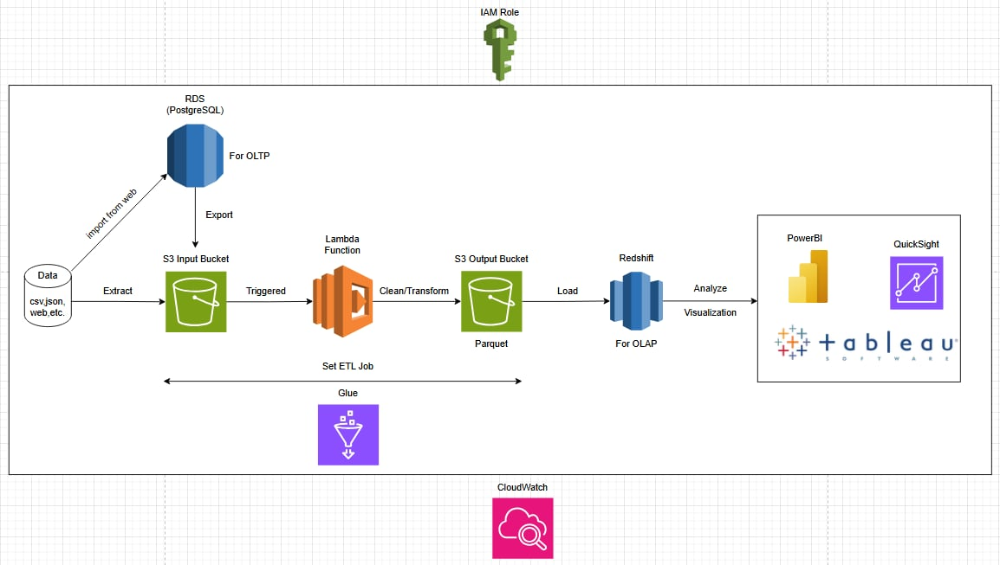

# Battery Test Data Pipeline (AWS)

An end-to-end, serverless ETL pipeline on AWS for cleaning, transforming, and
analyzing battery-cycler test data. Built as an academic / personal portfolio
project to demonstrate a realistic OLTP → S3 → Lambda → Glue → Redshift → BI
architecture.

> **Status:** portfolio / academic project.

## Architecture



```
Data (csv/json/web)
   ├──> RDS PostgreSQL (OLTP: app users + upload metadata) ──export──┐
   └──> S3 Input Bucket ("Extract") <───────────────────────────────┘
                │
                │ S3 ObjectCreated event
                ▼
        AWS Lambda (clean/transform)
                │  writes cleaned CSV
                ▼
        S3 Output Bucket (cleaned/*.csv)
                │
                │ triggered / scheduled
                ▼
        AWS Glue ETL Job (CSV → Parquet, load)
                │
                ▼
        Amazon Redshift (OLAP, star-schema-ready)
                │
                ▼
     PowerBI / QuickSight / Tableau (visualization)

IAM Role      → least-privilege execution roles for Lambda, Glue, Redshift
CloudWatch    → logs + alarms for Lambda errors/duration and Glue job failures
```

See [`docs/architecture.md`](docs/architecture.md) for the full data-flow
explanation, and [`docs/design-decisions.md`](docs/design-decisions.md) for
notes on choices made while reconciling the original whiteboard diagram with
the actual implementation.

## Repo layout

```
.
├── lambda/            # Cleaning/transform Lambda (Python)
├── glue/               # Glue ETL job: CSV -> Parquet -> Redshift load
├── sql/                # RDS (app metadata) and Redshift (analytics) schemas
├── terraform/           # Full IaC: S3, Lambda, Glue, Redshift, RDS, IAM, CloudWatch
├── sample_data/          # Synthetic sample cycler export for local testing
├── docs/                # Architecture notes, design decisions, diagram
└── .github/workflows/    # CI: terraform fmt/validate, python lint
```

## Data flow summary

1. **Ingestion** – Raw cycler exports (CSV/JSON) either land directly in the
   S3 input bucket, or are imported into RDS PostgreSQL first (as an
   application "upload" record, see `sql/rds_app_schema.sql`) and then
   exported to the same S3 input bucket.
2. **Clean/transform (Lambda)** – An S3 `ObjectCreated` event triggers
   `lambda/lambda_function.py`, which parses the cycler's `Xd HH:MM:SS.ss`
   time format into seconds/hours, drops empty/unwanted columns, and writes
   a cleaned CSV to the output bucket.
3. **Convert & load (Glue)** – `glue/glue_etl_job.py` reads the cleaned CSVs,
   converts them to Parquet (partitioned by date), and loads them into
   Redshift via a JDBC/Glue connection.
4. **Analyze** – Redshift is queried directly by PowerBI, QuickSight, or
   Tableau for reporting/visualization.
5. **Observability** – CloudWatch Logs + alarms cover Lambda errors/duration
   and Glue job failures.

## Getting started (local)

```bash
# Lambda unit-style smoke test against the sample file
cd lambda
pip install -r requirements.txt
python -c "
import lambda_function as lf
import pandas as pd
df = pd.read_csv('../sample_data/sample_battery_test.csv', skiprows=1)
print(df.head())
"
```

## Deploying the infrastructure

```bash
cd terraform
cp terraform.tfvars.example terraform.tfvars   # fill in your own values
terraform init
terraform plan
terraform apply
```

See [`terraform/README.md`](terraform/README.md) for module-by-module notes,
required variables, and cost/security caveats.

## Disclaimer

This repository is for **academic and personal-portfolio use**. It is not a
production-hardened system: secrets are expected to come from environment
variables / a secrets manager (never committed), Redshift/RDS are sized for
demo workloads, and IAM policies are intentionally scoped tight rather than
broad. Review and adjust before using against real data or in a real AWS
account.

## License

MIT — see [`LICENSE`](LICENSE).
