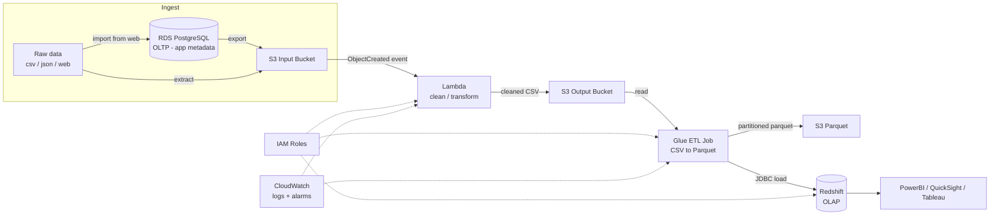

# Architecture

## Diagram

## Components

| Component        | Role                                                                 |
|-------------------|-----------------------------------------------------------------------|
| RDS PostgreSQL    | OLTP store for the upload web app: `admin_users` (who can upload) and `upload_users` (metadata about each uploaded file). Out of scope for this repo's app code — schema only, see `sql/rds_app_schema.sql`. |
| S3 Input Bucket   | Landing zone for raw cycler exports, whether uploaded directly or exported from RDS. |
| Lambda            | Triggered per-object; parses cycler time format, drops unused columns, writes cleaned CSV. |
| S3 Output Bucket  | Cleaned CSVs, also the Glue job's read source.                        |
| Glue ETL Job      | Converts cleaned CSV to partitioned Parquet, loads Redshift via JDBC.  |
| Redshift          | OLAP store queried by BI tools.                                       |
| IAM               | Least-privilege roles scoped per-service (see `terraform/iam.tf`).    |
| CloudWatch        | Log groups for Lambda/Glue + alarms on errors/duration/failures.      |

## Why two S3 buckets before Redshift (not one)?

Keeping "cleaned CSV" (Lambda output) and "Parquet" (Glue output) as
separate buckets/prefixes makes each stage independently re-runnable and
debuggable: you can inspect the cleaned CSV without needing to unpack
Parquet, and you can re-run the Glue conversion against existing cleaned
CSVs without re-triggering the Lambda.

## Trigger model

- **S3 → Lambda**: real-time, event-driven (`s3:ObjectCreated:*`).
- **Lambda → Glue**: not event-driven in this repo — the Glue job is set up
  with an optional hourly schedule trigger (`terraform/glue.tf`,
  `aws_glue_trigger.scheduled`, disabled by default). For true event-driven
  chaining, add an S3 event → SQS/Step Functions → `StartJobRun` in front
  of it.
